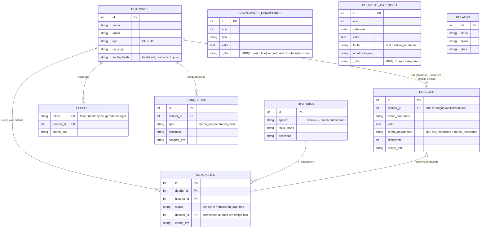

# Documentação técnica — Estrutura do banco de dados

**Projeto:** MVP Instituto Ebenézer (Desafio A) · Módulo 3 — Inteli MBA em IA e Dados para Negócios
**Banco:** SQLite (`node:sqlite`), arquivo `data/ebenezer.db`
**Gerado a partir de:** `server.js` (schema real do projeto, não hipotético)

Este documento responde ao Exercício 03 ("Finalizando o Projeto"), aplicado ao nosso projeto real (não ao exemplo genérico "App do Garçom" usado no enunciado): diagrama do banco de dados e duas coisas que ainda não sabemos se funcionam.

## 1. Diagrama do banco de dados

O banco tem 9 tabelas. `doadores` é o centro do modelo — quase tudo se relaciona a um doador, exceto os dados institucionais (`indicadores_financeiros`, `despesas_categoria`, `relatos`), que existem independente de quem doa.

## 2. O que cada tabela representa

**doadores** — conta da pessoa (PF) ou empresa (PJ) que doa. Nasce só quando alguém se cadastra de verdade (US-F4); uma doação pode existir sem conta (doação avulsa). Guarda o hash da senha, nunca a senha em texto puro.

**sessoes** — uma linha por login ativo. É o que torna a "área do doador" protegida: cada chamada à API carrega um token que aponta pra essa tabela, e o servidor confere se o dono da sessão é o mesmo doador que está pedindo os dados.

**doacoes** — toda doação registrada, recorrente ou avulsa. `doador_id` fica nulo quando é doação anônima — está no design do fluxo validado no Figma que doar não exige conta.

**indicadores_financeiros** e **despesas_categoria** — dados institucionais (custo por aluno, ESG, receita, despesas por categoria) usados na Transparência e no painel financeiro da área do doador. Não dependem de nenhum doador específico.

**conquistas** — selos de marco (ex.: "6 meses ao lado do Instituto") calculados a partir do histórico de doações de cada doador.

**historias** — perfis fictícios de crianças atendidas, usados na indicação "Adotar uma criança" (US-F2). Nunca nome ou foto real, por proteção ECA/LGPD.

**indicacoes** — o registro de "Renata indicou a história X pro amigo Y". Quando o amigo doa, `doacao_id` é preenchido e o status muda pra "encontrou_padrinho".

**relatos** — feed de novidades do Instituto, mostrado na aba "Novidades" da área do doador.

## 3. Duas coisas que ainda não sabemos se funcionam

**(1) Os dados sobreviverem a um reinício do servidor — depende de onde ele está rodando.**
Essa é literalmente uma das três condições do próprio exercício, e a resposta é diferente conforme o ambiente. Rodando localmente (`npm start` no seu PC), o arquivo `data/ebenezer.db` fica no disco normal e sobrevive a qualquer reinício — isso já testamos e funciona. Mas no Render (onde o link público está publicado, plano gratuito), o disco é efêmero: toda vez que o serviço reinicia (o que acontece sozinho após ~15 min sem uso, ou a cada novo deploy), o banco volta ao estado semeado de fábrica, e qualquer cadastro/doação feito na URL pública some. Ou seja: a condição "mantém os dados depois que o servidor é desligado e ligado de novo" é verdadeira no ambiente local e falsa no ambiente publicado — ponto que já está registrado no README como limitação conhecida, não escondido.

**(2) O cadastro impedir e-mail duplicado sob uso simultâneo — nunca testamos isso de verdade.**
A checagem de e-mail já existente hoje é feita em duas etapas no código (`SELECT` pra ver se o e-mail já existe, e só depois o `INSERT`) — não existe uma restrição `UNIQUE` na própria coluna `email` da tabela `doadores` garantindo isso no nível do banco. Isso funciona bem no caso comum (uma pessoa cadastrando por vez, que foi o que testamos), mas nunca testamos duas pessoas tentando se cadastrar com o mesmo e-mail ao mesmo tempo — nesse cenário, as duas requisições poderiam passar pela checagem antes de qualquer uma delas ter terminado o `INSERT`, criando duas contas com o mesmo e-mail. Aliás, é exatamente esse tipo de duplicidade que apareceu no nosso banco local de testes (duas linhas com o mesmo e-mail) — hoje atribuída a testes de uma versão anterior do sistema, mas que mostra que o cenário é possível e que a garantia de unicidade real precisaria de um `UNIQUE` no schema, não só de uma checagem no código.
